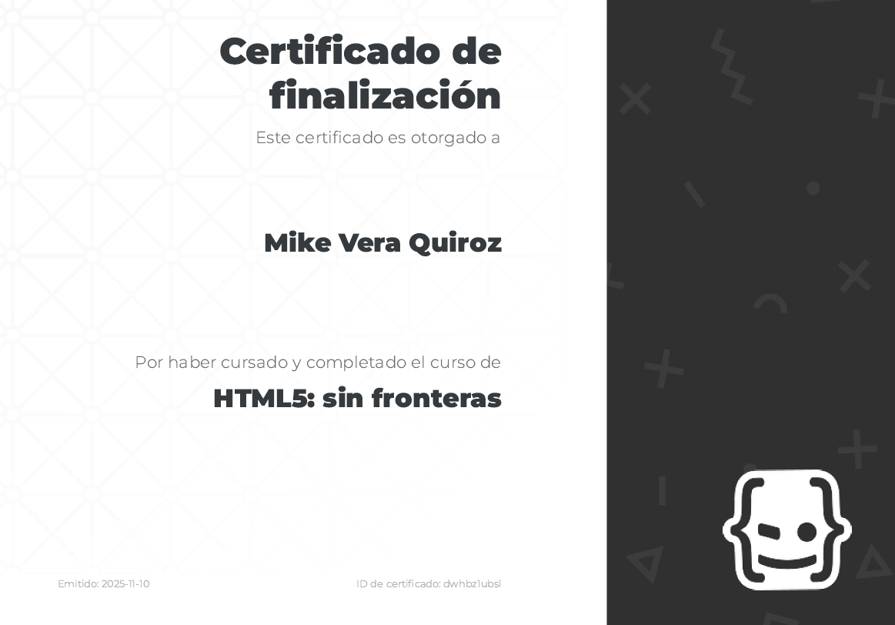

## HTML Course with Nicolas Schurmann

```bash
# Academy
$ https://academia.holamundo.io/courses/html5-la-guia-completa
```

```bash
# My Certificate
$ https://academia.holamundo.io/certificates/dwhbz1ubsl
```
[](https://academia.holamundo.io/certificates/dwhbz1ubsl)

<a href="https://academia.holamundo.io/certificates/dwhbz1ubsl" target="_blank">
  
</a>
